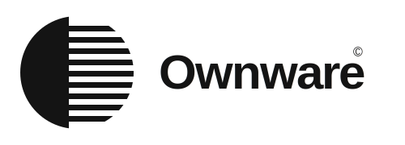

<p align="center">
  <picture>
    <source media="(prefers-color-scheme: dark)" srcset="docs/assets/ownware-lockup-dark.svg">
    
  </picture>
</p>

<p align="center">
  <strong>Build your own AI agent — alive everywhere you already are.</strong><br>
  <em>The magic of a personal AI agent — living in your channels, texting you every
  morning, doing real work — but it's <strong>yours</strong>: your brand, your model,
  your machine. For your business, or your life.</em>
</p>

<p align="center">
  <a href="https://docs.ownware.dev"></a>
  <a href="LICENSE"></a>
  
  
  <a href="CONTRIBUTING.md"></a>
</p>

<p align="center">
  <a href="https://docs.ownware.dev"><strong>📖 Read the docs → docs.ownware.dev</strong></a>
</p>

---

## Build your *own* agent — and put it everywhere you already are.

You've seen the magic: an agent living in your Telegram, texting you every morning,
doing real work on a real machine. **But the ones you've met are someone else's agent —
their brand, their choices.** You can configure them; you can never truly make one
yours, and you certainly can't ship it to your own customers.

Ownware is the kit for building your own — **an agent for anything:**

- an agent in your **shop** that answers customers and reads your orders,
- an agent in your **Slack** that works on your team's data — and the data stays yours,
- an agent for your **own day** that reads your inbox and DMs you the summary,
- a branded agent an **agency ships to every client**, again and again.

Same kit, different text. One agent → alive in Slack, Telegram, your website, your app,
scheduled every morning — **self-hosted, any model, safe by default. You own all of it.**

If this resonates: **⭐ star the repo** — it's how a solo-dev project gets seen — and
[come build it with me](#give-us-a-hand).

## Why Ownware exists

I'm a solo developer who's lived with a personal agent in my Telegram — one that
texts me every morning and does real work. It's magic. But it showed me the gap:
agents are now powerful enough to automate almost anything, yet almost no business, no
shop, no team runs one of their **own**. The magic is stuck with hobbyists, while every
business around me still burns its days on the repetitive 80%.

Freeware was free. Shareware was shared. **Ownware is owned** — describe your agent in
a folder of text, run it as one process on your machine, put it to work on every
surface, and let it work 24/7 while you grow the thing you actually care about. The
next piece — being built now — is **the face**: a white-label chat UI you brand as
your own, dropped into your SaaS or as a widget on any site, so your users talk to
*your* agent and never see Ownware.

Everything here is **free and open (Apache-2.0)** — the engine, the gateway, the
channels, the security. It's also how builders and agencies ship agents as a service:
one per client, white-labeled, on the client's own infrastructure. The kit is not the
thing you pay for.

---

## How it works

```
1. BUILD the agent as a folder of text   →   2. RUN it as one process   →   3. REACH it from anywhere
        (a "profile")                          (ownware serve)               (one HTTP+SSE contract)
```

- **Any model.** Anthropic, OpenAI, Google, OpenRouter — or fully local via
  [Ollama](https://ollama.com). The first answer works **without any API key**.
- **Yours.** Self-hosted, your keys never leave your machine (encrypted vault),
  all data in `~/.ownware/` on your box.
- **Safe by default.** Exposing beyond localhost force-enables auth + TLS; an
  unsafe bind refuses to boot. Dangerous tool calls pause and ask first.
- **One wire contract.** The CLI, the SDK, Slack, your future app — all talk to the
  agent the same way. Learn it once, build anything.

### A real engine underneath — not a framework, not a wrapper

This is the part that makes the magic real instead of a demo. Ownware isn't a box of
parts you assemble, and it isn't a thin wrapper around someone else's loop. The engine
is a **from-scratch agent runtime — the same class of machine as Claude Code**
(streaming, parallel tool orchestration, sub-agents, pluggable compaction, retry with
backoff, MCP) — but **model-agnostic and yours to self-host.** You don't build the loop
and own its bugs; you inherit a good one and point it at any model.

- **Frameworks** (LangChain, CrewAI) hand you parts — the loop quality is your problem.
- **Lab SDKs** (Claude Agent SDK, OpenAI Agents SDK) are excellent harnesses — locked
  to one company's models.
- **Ownware** is a Claude-Code-*class* harness for *any* model, that you own and run
  yourself. That's the empty middle nobody else fills.

> **Status:** early and moving fast. The npm publish is imminent; until it lands, install
> from source (below). The engine, gateway, channels, and security are built and covered by
> an automated test suite (7,000+ tests across the packages); the five channel adapters are
> at varying maturity. It's early software — expect rough edges and tell us where you hit them.

## Step 0 — Install

Requires Node ≥ 22 (plus [bun](https://bun.com) ≥ 1.3 if you build from source).

```bash
npm  install -g ownware      # or:  bun add -g ownware  ·  pnpm add -g ownware
```

Now you have the `ownware` command. Check it: `ownware --help`.

> 📦 **Not on npm quite yet** (days away). Until then, run it from source — the same
> commands, just prefixed with `bun run`:
> ```bash
> git clone https://github.com/ownware-ai/ownware.git && cd ownware
> bun install && bun run build        # then use `bun run ownware …` in place of `ownware …`
> ```

## Step 1 — Build your agent (it's just a folder of text)

```bash
ownware init
```

That drops a starter agent into `./profiles/assistant/`:

```
profiles/assistant/
├── agent.json   # WHAT it can do — model, tools, security
└── SOUL.md      # WHO it is — personality and rules (plain markdown)
```

**Editing these files IS building the agent.** No SDK, no build step, no wizard. Open
`SOUL.md` and change its personality. Open `agent.json` and:

- pick any model — `"anthropic:claude-sonnet-4-6"`, `"openai:gpt-4o"`,
  `"ollama:llama3.2"` (local, free)…
- give it tools — built-in presets (files, shell, web), **any MCP server**, 400+ SaaS
  apps via Composio, or your own custom tool files
- set its security — permission mode, security level, allow/deny lists

Add `skills/` (markdown how-tos) and `AGENTS.md` (its memory) as it grows. Because an
agent is text, you can version it in git, review it in a PR, and share it like a
package — [`profiles/`](profiles) ships ready-made examples (law, finance, research,
security, trading…).

Full format: [docs/agents/profile-format.md](docs/agents/profile-format.md)

**Now talk to it — right here, no server:**

```bash
ownware key add anthropic          # save a key once (or go keyless with Ollama)
ownware run assistant "hello — introduce yourself"
```

`ownware run` assembles the agent and streams its reply straight to your terminal — no
gateway, no glue. That's the whole build → talk loop. (Prefer another folder as its
workspace? `ownware run assistant -w ./my-app "…"`.) Every command:
[**the `ownware` CLI reference →**](docs/reference/cli.md)

## Step 2 — Serve it (one process, locally today, anywhere tomorrow)

You only need this when something *else* has to reach the agent — Slack, a web app, a
schedule. It's the same agent, now a service:

```bash
ownware serve
```

Your agent is now a **live HTTP+SSE service** at `http://localhost:3011` — runs and
streaming replies, persistent conversation threads, the credential vault, permission
approvals, schedules, channels: the whole backend in one process. `serve` prints a
copy-paste curl that answers immediately:

```bash
curl -X POST http://localhost:3011/api/v1/run \
  -H 'Content-Type: application/json' \
  -d '{"profileId":"assistant","prompt":"hello"}'
```

**No API key?** Install Ollama (`ollama pull llama3.2`) and it answers fully local.
Have a key? `ownware key add anthropic` stores it encrypted.

### How deployment works (today)

The gateway is deliberately **one ordinary Node process + one data folder**
(`~/.ownware`). Deploying = running that same command on any machine — a VPS, a
Raspberry Pi, a container:

```bash
ownware serve --host 0.0.0.0 --port 3011
```

The moment the bind leaves localhost, Ownware's **bind-safety invariant** kicks in
automatically: auth forced ON (clients need `Authorization: Bearer <token>` — printed
at boot, persisted at `~/.ownware/gateway-token`), TLS forced ON, and disabling either
**refuses to boot**. There is no accidentally-open deployment. For browsers / real
domains, put a reverse proxy or tunnel (Caddy, nginx, Tailscale, cloudflared) in front
— [docs/gateway/exposing.md](docs/gateway/exposing.md).

**Single-click deploy?** Not yet — honestly. Today it's *one command*, not one click.
Because the platform is one process + one folder, one-click templates (Docker,
Railway/Render/Fly buttons) are a thin wrapper and on the roadmap. If it runs Node, it
runs Ownware now.

## Step 3 — Talk to it (four doors, one contract)

**Door 1 — Raw HTTP.** Any language: `POST /api/v1/run` starts a run, an SSE stream
delivers the reply token by token. Fully specified in
[`packages/client/spec/`](packages/client/spec) (OpenAPI + AsyncAPI).

**Door 2 — The SDK.** [`@ownware/client`](packages/client): zero dependencies, Node
*and* browser:

```ts
import { OwnwareClient } from '@ownware/client'

const agent = new OwnwareClient({ baseUrl: 'http://localhost:3011' })
const { threadId } = await agent.run({ profileId: 'assistant', prompt: 'hello' })
for await (const ev of agent.streamReply(threadId)) {
  if (ev.type === 'delta') process.stdout.write(ev.text)
}
```

**Door 3 — Messaging.** The same agent answers in Slack, Telegram, Discord, WhatsApp,
SMS — `ownware serve` runs the channels in-process, no second deployment:

```bash
ownware channel add slack --profile assistant --bot-token xoxb-… --app-token xapp-…
ownware serve      # gateway + Slack, one process
```

Unknown senders are held behind fail-closed pairing until you
`ownware channel approve` them — your agent doesn't talk to strangers.

**Door 4 — Proactive.** Don't just answer — reach out on a schedule:

```bash
ownware schedule add --profile assistant --name morning \
  --prompt "summarize my inbox" --daily 08:30 --deliver slack:#general
```

Every morning at 08:30 the agent runs and posts its answer to `#general`. Quiet days
stay quiet; failures are reported honestly — `ownware schedule runs <id>` shows the
true ledger, never a silent drop.

## Step 4 — Build your own application on top

The gateway is a full agent backend; your product only needs a frontend (or another
backend) that speaks the wire contract. You need exactly three things: the **URL**, the
**token** (when exposed), and a client — `@ownware/client` or plain fetch in any
language.

| Call | What it does |
|---|---|
| `run({ profileId, prompt, threadId? })` | Send a message. Same `threadId` = same conversation. |
| `streamReply(threadId)` | One reply as streaming text deltas → done. |
| `events(threadId)` | The RAW stream — tool calls, thinking, permission requests. Build rich UIs from this. |
| `resume(threadId, { action })` | Answer a `permission.request` — approve/deny in *your* UI. |
| `abort(threadId)` | Stop button. |
| `models()` / `health()` | Model catalog with live availability / liveness. |

That's enough for a support widget, an internal copilot, a mobile app, a voice bot.
Threads give every user a continuous, isolated conversation; dropped connections resume
from the last event; the permission flow lets your app surface approvals natively.
Non-JS teams generate clients from the [OpenAPI/AsyncAPI spec](packages/client/spec).

Prefer to stay in-process? The whole backend is a library:

```ts
import { OwnwareGateway } from 'ownware'
const agent = new OwnwareGateway({ profilesDir: './profiles', port: 4000 })
await agent.start()
```

## Everything in the kit today (all free, all open)

<table>
<tr><td><b>Agents as text</b></td><td>A profile is a folder — <code>agent.json</code> + <code>SOUL.md</code> + skills + memory. Version it, review it, share it. Bundled examples in <a href="profiles"><code>profiles/</code></a>.</td></tr>
<tr><td><b>Any model, keyless first</b></td><td>Anthropic, OpenAI, Google, OpenRouter, or local Ollama. First answer needs no API key; keys live in an encrypted vault (<code>ownware key add</code>).</td></tr>
<tr><td><b>A real agent engine</b></td><td>Provider-agnostic loop with streaming, parallel tool orchestration, retry with backoff, checkpointing — production plumbing, not a demo loop.</td></tr>
<tr><td><b>Batteries-included tools</b></td><td>Your agent works out of the box: <b>filesystem</b> (read/write/edit/glob/grep), <b>shell</b> (guarded, with persistent sessions), <b>real browser automation</b> (Playwright-backed — navigate, click, extract), <b>web search + fetch</b>, task lists, memory, ask-the-user. <b>Image generation</b> and <b>speech</b> (TTS/STT) are bring-your-own-provider hooks. Full computer use: coming soon.</td></tr>
<tr><td><b>Any integration</b></td><td><b>Any MCP server</b> (stdio or url), 400+ SaaS apps via Composio, or your own custom tool files (<code>defineTool</code>) — declared in <code>agent.json</code>, no engine code.</td></tr>
<tr><td><b>Multi-agent</b></td><td>Agents spawn sub-agents: isolated workers for parallel workstreams, forked contexts, a coordinator protocol — one agent can run a team.</td></tr>
<tr><td><b>Never dies at the context limit</b></td><td>Pluggable compaction strategies — summarize, sliding window, truncate, tool-result drop, hierarchical — so long-running tasks keep going instead of hitting a wall.</td></tr>
<tr><td><b>One-process backend</b></td><td><code>ownware serve</code>: HTTP/2 + SSE gateway, persistent threads, resumable streams, schedules, vault, auth — the whole backend as one process or one class.</td></tr>
<tr><td><b>Messaging channels</b></td><td>Slack, Telegram, Discord, WhatsApp, SMS — run in-process with <code>ownware serve</code>; fail-closed pairing for unknown senders.</td></tr>
<tr><td><b>Proactive schedules</b></td><td>Daily / interval / one-off runs (timezone- and DST-correct) that deliver results to a channel — with an honest run ledger.</td></tr>
<tr><td><b>SDK + wire spec</b></td><td><code>@ownware/client</code>: zero-dep, Node + browser. OpenAPI + AsyncAPI specs for every other language.</td></tr>
<tr><td><b>Security stack</b></td><td>Bind safety (no unsafe boot), credential vault (engine only sees opaque handles), 7-level zones + combination rules, human-in-the-loop permission gates, draft-approval for unattended runs. Core and free, forever.</td></tr>
<tr><td><b>CLI</b></td><td><code>ownware profile · run · serve · key · channel · schedule</code> — build, talk to, and deploy an agent from one command; full <a href="docs/reference/cli.md">CLI reference</a>. No wizard.</td></tr>
</table>

## Safe by default (the reason your boss says yes)

Security primitives are core and free — never a paid tier: bind safety (non-loopback
forces auth + TLS), the encrypted credential vault (no secret ever in plaintext — not
in events, logs, or the DB), zone classification with combination rules (catches *read
a secret, then call the network*), and permission gates wired into the public contract
so every client can render approve/deny. It's the closer, not the headline — the reason
the answer is *yes* when compliance asks "can we actually deploy this?" Full story:
[docs/security/overview.md](docs/security/overview.md)

## Status & roadmap

Built and test-covered today: engine + gateway, profile format, CLI verbs, keyless first
answer, bind-safety, `@ownware/client` + wire spec, five channel adapters in-process,
schedules with channel delivery.

Next, roughly in order:

1. **npm publish** — `npm i ownware` instead of a clone.
2. **The UI kit (`@ownware/ui`)** — a white-label, themeable chat UI served by the
   gateway + a `<script>` embed widget: your brand on your landing page, inside your
   SaaS, as your product's support agent — your users never see Ownware.
3. **One-click deploy templates** — Docker + Railway/Render/Fly buttons.
4. **Embed adapters** — Shopify / WordPress / Wix: install your agent into your own
   store like any other plugin.
5. **Live demo recordings** — "it answered in my Slack" and security-in-action clips.

## Give us a hand

Ownware is one person and a big goal: **every business and every person running their
own agent.** If you're like-minded:

- **⭐ Star the repo** — visibility is oxygen for a solo project.
- **Open an issue** — tell me the agent you tried to build and where the kit fought
  you. Activation friction is a bug.
- **Send a PR** — [CONTRIBUTING.md](CONTRIBUTING.md) has the setup and the hard rules;
  [VISION.md](VISION.md) has where this is going and the "what we won't merge (for now)"
  list — two minutes there saves a wasted PR. Great first contributions: a new channel
  adapter (a channel is a thin client of one contract — a weekend, not a fork), an
  example profile for your industry, docs fixes, deploy templates.

Everyone interacting here is expected to follow the
[Code of Conduct](CODE_OF_CONDUCT.md).

## Docs by goal

| You want to… | Read |
|---|---|
| See it run in 5 minutes | [Step 0](#step-0--install) above, or the [quickstart](docs/getting-started/quickstart.md) |
| Every `ownware` command | [docs/reference/cli.md](docs/reference/cli.md) |
| Build / customize an agent | [docs/agents/profile-format.md](docs/agents/profile-format.md) |
| Put it on a server safely | [docs/gateway/exposing.md](docs/gateway/exposing.md) |
| Understand the security model | [docs/security/overview.md](docs/security/overview.md) |
| Build an app on the API | [packages/client/spec](packages/client/spec) (OpenAPI + AsyncAPI) |
| Configure every knob | [docs/reference/configuration.md](docs/reference/configuration.md) |
| Get a quick answer / fix a problem | [docs/faq.md](docs/faq.md) · [docs/troubleshooting.md](docs/troubleshooting.md) |
| Everything else | [docs/index.md](docs/index.md) |

## Development

```bash
bun run build        # all packages, dependency order
bun run typecheck    # every package
bun run test         # every suite (LLM/network e2e lanes are env-gated)
bun run smoke        # keyless first-run canary: boot + health + models
```

Data lives in `~/.ownware/` (`OWNWARE_DATA_DIR` overrides). Security reports:
[SECURITY.md](SECURITY.md).

## License

[Apache-2.0](LICENSE) — free for any use, including commercial.
